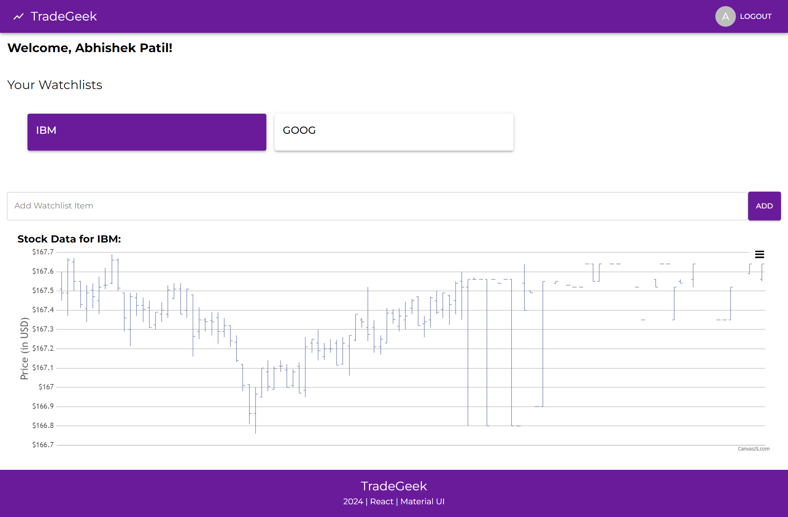

# Django-React Stock Management App

This is a simple project built using Django and React as part of a task. The application allows users to register, log in, manage their stocks, view stock charts, and track the history of selected stocks.

## Features

- **User Authentication**: Users can register and log in securely.
- **Stock Management**: Users can manage their stock portfolio.
- **Stock Charts**: View charts of stocks for better insights.
- **Stock History**: Track the history of selected stocks.

## Screenshots

### Homepage


### Dashboard


### Login Page


### Registration Page


## Technologies Used

- **Frontend**: React.js
- **Backend**: Django
- **Charting Library**: Chart.js or equivalent for stock charts
- **Hosting**: Vercel

## Branches

This repository contains both the frontend and backend code:

- The **main** branch contains the frontend built with React.
- The **backend** branch contains the backend code built with Django.

## How to Run Locally

1. Clone the repository:
   ```bash
   git clone https://github.com/Abhip32/django-react.git
   ```
2. Navigate to the project directory:
   ```bash
   cd django-react
   ```
3. Install backend dependencies:
   ```bash
   pip install -r requirements.txt
   ```
4. Set up the database:
   ```bash
   python manage.py migrate
   ```
5. Run the Django development server:
   ```bash
   python manage.py runserver
   ```
6. In a new terminal, navigate to the `frontend` directory and install dependencies:
   ```bash
   cd frontend
   npm install
   ```
7. Start the React development server:
   ```bash
   npm start
   ```
8. Open your browser and visit:
   ```
   http://localhost:3000
   ```

## Contributing

Contributions are welcome! If you'd like to contribute, follow these steps:

1. Fork the repository.
2. Create a new branch:
   ```bash
   git checkout -b feature-name
   ```
3. Commit your changes:
   ```bash
   git commit -m "Add some feature"
   ```
4. Push to the branch:
   ```bash
   git push origin feature-name
   ```
5. Open a pull request.
